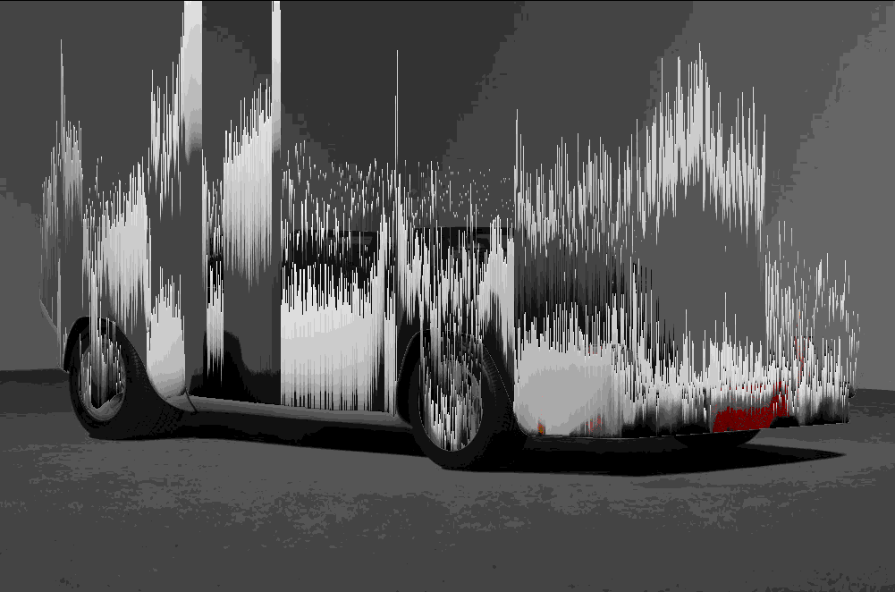

# Pixelsorter

#### A PNG pixel sorting utility of dubious usefulness




## Build

Ensure you have installed Go - this can be accomplished [here](https://go.dev/doc/install)

Clone the repository, and run 
```
go build 
```
from inside.

## Usage
 By default, pixelsorter requires the `-in` flag to specify the input file. Thus, the minimum required invocation is as follows:
 ```
 ./pixelsorter -in /path/to/input/file.png
 ```
 PNG Is the preferred filetype. Pixelsorter is able to read other formats automatically (for the most part), but PNG is the only officially supported format.

 Other flags are available, and can change the sorting effect in several ways. See 
 ```
 ./pixelsorter --help
 ``` 
 for the full list of flags.


