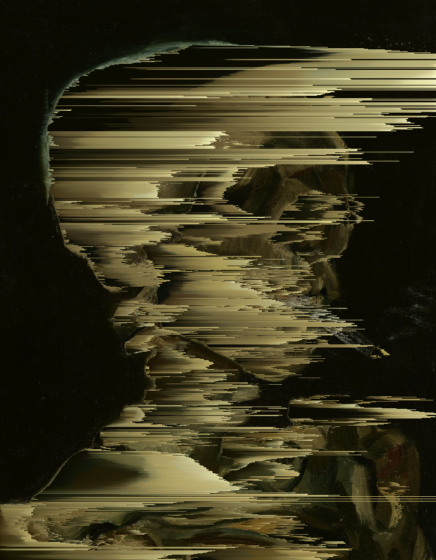

# Pixelsorter

#### A PNG pixel sorting utility of dubious usefulness
<p align="center">

</p>


## Build

Ensure you have installed Go - this can be accomplished [here](https://go.dev/doc/install)

Clone the repository, and run 
```
$ go get .
$ go build 
```
from inside.

## Usage
### Static Sorting 
 By default, pixelsorter requires the `-in` flag to specify the input file. Thus, the minimum required invocation is as follows:
 ```
 $ ./pixelsorter -in /path/to/input/file.png
 ```
 PNG Is the preferred filetype. Pixelsorter is able to read other formats automatically (for the most part), but PNG is the only officially supported format.

 Other flags are available, and can change the sorting effect in several ways. See 
``` 
$ ./pixelsorter --help
```

 for the full list of flags. A document describing each flag and their effects on the algorithm is planned.

### WAV-Driven Sorting
<p align="center">

</p>

 Pixelsorter can also combine a .wav audio file and an input image to create a visualization animation. It can output to a (soundless) .GIF, or can write individual frames into a local directory `./frames/`. Pixelsorter can't combine the video and audio together just yet, so I recommend using [ffmpeg](https://ffmpeg.org/download.html) to do that. Frames are written with the format `FRAME_<#>.png`, enabling ffmpeg to automatically order them correctly.

 The minimum invocation for .wav-driven sorting is as follows, and will generate a .GIF output by default:
 ```
$ ./pixelsorter -in /input/file.png -anim -wav /audio/file.wav 
 ```

 All option flags that apply to static sorting also apply to .wav-driven sorting. The amplitude of the audio signal is applied to sort spans AFTER the scalar and noisefactor parameters.


#### IMPORTANT NOTES FOR WAV-DRIVEN SORTING
1. If the desired output is .GIF, specifying a framerate that is not a factor of or divisible by 100 **will cause the video and audio to drift out of sync**. This is a limitation of the .GIF encoding implementation in the Go standard library.
2. The concurrency implementation is currently EXTREMELY greedy and will peg the CPU at 100% until processing is complete. Use discretion when performing lengthy video sorts.
3. Using long audio files as input to generate .GIFs can cause Pixelsorter to use a lot of memory. .GIF output is compressed, but it still must be held in memory until all frames have been processed. If you need a long animation, or don't have much memory available in general, consider using `-write_frames` and postcompositing instead, as the memory overhead is significantly *(orders of magnitude)* lower, and ffmpeg was written by better programmers than I.

